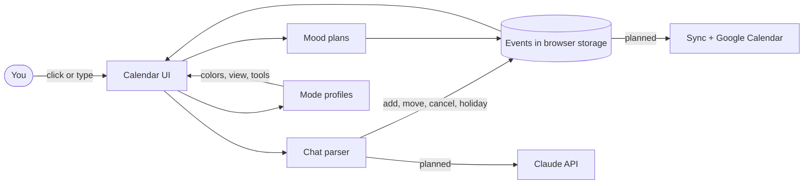

# 🍡 Mochi Calendar

**A soft, themed calendar with a little AI friend who plans your life with you.**
Text it "dentist tomorrow 3pm" and it's on your calendar. Tell it you're stressed and it suggests a matcha afternoon with your top 3 friends. Switch to Exam, Work or Vacation mode and the whole app rearranges itself around what you're doing.


**Live demo:** `https://YOUR-USERNAME.github.io/mochi-calendar/`

> **Status: working prototype.** The calendar, chat commands, modes, moods, Discover board and holiday planner all run in the browser today. Cross-device sync, real Claude-powered chat and Google Calendar sync are on the roadmap below and are **not built yet**.

---

## ✨ What it does

| | |
|---|---|
| 📅 **Real calendar** | Day, Week and Month views. Click a day to open it, click a time slot to add an event, click an event to edit or delete it. Overlapping events sit side by side. |
| 💬 **Chat with Mochi** | Add, move, cancel and look up events by typing. Every change can be undone with "undo". |
| 🌈 **Mood suggestions** | Pick a mood (stressed, sad, tired, happy, anxious, bored) and get three plan buttons. Tap one to add it to your day, with your top friends included, or draft an invite. |
| 🎛️ **Four modes** | **Everyday**, **Exam**, **Work**, **Vacation**. Each has its own colors, default view, mood suggestions, chat shortcuts and tools (see below). |
| 🧭 **Discover nearby** | A Pinterest-style board of ideas ranked by your hobbies. Save cards or send them to your calendar. |
| ✈️ **Holiday planner** | Give it dates. It blocks the days, moves anything in the way to the day after you return, and fills free days with ideas. |
| 👯 **Friends** | Star up to 3 top friends. Mood plans include them. |
| 📱 **Installs like an app** | Works on Windows (Edge or Chrome) and iPhone (Safari) from one codebase, and works offline after the first visit. |

### The four modes

| Mode | Colors | Opens in | Special tools |
|---|---|---|---|
| 🍵 Everyday | Matcha green | Month | Friends, Discover, holiday, all moods |
| 📚 Exam | Indigo | Week | Exam list, **Plan study** (2-hour blocks at 4pm before each exam plus an early night), study-friendly moods |
| 💼 Work | Teal | Week | Work hours shading, **Protect my week** (daily focus block and lunch, Mon to Fri), work-friendly moods |
| 🌴 Vacation | Coral | Month | Trip countdown, editable packing list, adventure moods, Discover |

---

## 🗣️ Things to say to Mochi

```
Dentist tomorrow at 3pm
Lunch with Maya Friday noon
Study session Oct 12 4pm for 2 hours
Move gym to Friday 6pm
Cancel study group
I'm in Lisbon Dec 20 to 27
What's on today?
What's on this week?
Undo
```

> The chat currently uses a small built-in parser, so it understands phrasings like the ones above. The planned version sends your message to Claude, which handles much looser wording.

---

## 🚀 Deploy to your GitHub in 10 minutes

You need a free [GitHub](https://github.com) account and [Git for Windows](https://git-scm.com/download/win). No Node, no build step.

### Step 1. Get the files

Unzip `mochi-calendar.zip` somewhere easy, such as `C:\Users\YOU\mochi-calendar`. You should see `index.html`, `manifest.webmanifest`, `sw.js`, three icon files, `README.md`, `LICENSE` and a `.github` folder.

> If you can't see `.github`, turn on hidden items in File Explorer (View → Show → Hidden items). It has to be pushed along with everything else.

### Step 2. Create the repo

1. Go to [github.com/new](https://github.com/new).
2. Name it `mochi-calendar`.
3. Choose **Public** (free GitHub Pages needs a public repo on a free account).
4. **Don't** tick "Add a README", "Add .gitignore" or "Choose a license". The folder already has them.
5. Click **Create repository**.

### Step 3. Push the code

Open **PowerShell** inside your `mochi-calendar` folder (right-click in the folder → Open in Terminal). Run these one at a time, replacing `YOUR-USERNAME`:

```powershell
git init
git add .
git commit -m "Mochi Calendar: first release"
git branch -M main
git remote add origin https://github.com/YOUR-USERNAME/mochi-calendar.git
git push -u origin main
```

The first push opens a browser window to sign in to GitHub. That's normal. If Git says it doesn't know who you are, run these once and then retry the commit:

```powershell
git config --global user.name "Your Name"
git config --global user.email "you@example.com"
```

**Shortcut with the GitHub CLI:** if you have `gh` installed and signed in (`gh auth login`), skip Steps 2 and 3 and run this inside the folder:

```powershell
git init && git add . && git commit -m "Mochi Calendar: first release"
gh repo create mochi-calendar --public --source=. --push
```

### Step 4. Turn on GitHub Pages

1. In your repo, open **Settings → Pages**.
2. Under **Build and deployment → Source**, choose **GitHub Actions**.
3. Open the **Actions** tab. A workflow called **Deploy to GitHub Pages** is already running (or run it from the tab with "Run workflow").
4. When it goes green (about a minute), your site is live at:

```
https://YOUR-USERNAME.github.io/mochi-calendar/
```

From now on, every `git push` to `main` redeploys automatically.

<details>
<summary><b>Prefer no workflow? Deploy straight from the branch instead</b></summary>

1. Delete `.github/workflows/pages.yml` from the repo.
2. Go to **Settings → Pages**, set Source to **Deploy from a branch**, choose `main` and `/ (root)`, and click Save.
3. Wait about a minute for the site to appear.

</details>

### Step 5. Install it on your laptop

Open your live link in **Edge or Chrome**. Click the install icon at the right end of the address bar (or menu → Apps → Install this site as an app). Mochi gets its own window and a Start menu entry.

### Step 6. Install it on your iPhone

1. Open your live link in **Safari** (other iPhone browsers can't add it to the home screen).
2. Tap the **Share** button.
3. Tap **Add to Home Screen**, then **Add**.

### Step 7. Update it later

Edit a file, then:

```powershell
git add .
git commit -m "Describe your change"
git push
```

The site updates in about a minute. Refresh once or twice, because the app caches itself for offline use. If you want to be sure everyone gets a fresh copy, change `mochi-v4` to `mochi-v5` in `sw.js` before you push.

---

## 🧪 Run it locally

```powershell
py -m http.server 8000
```

Then open <http://localhost:8000>. Use this instead of double-clicking `index.html`, because the offline and install features need a web server.

---

## 🛠️ Troubleshooting

| Problem | Fix |
|---|---|
| **Buttons don't respond** | Hard-refresh with `Ctrl+Shift+R`, or open the site in a private window. An old cached copy can linger. On iPhone, delete the home screen icon, reopen the link in Safari and add it again. |
| **404 on the live link** | Check Settings → Pages is set to *GitHub Actions* (or the branch option) and that the Actions run is green. Wait a minute after the first deploy. |
| **Actions run fails at "Setup Pages"** | Pages isn't enabled yet. Do Step 4, then click **Re-run all jobs**. |
| **Styling looks plain** | Fonts come from Google Fonts. Offline, the app falls back to your system font. This is expected. |
| **Events disappeared** | Data is stored in that browser only. Clearing site data, using a private window, or switching browser or device starts fresh. |
| **No install option on iPhone** | You must use Safari, and the page must be loaded over HTTPS (your GitHub Pages link is). |
| **`git push` asks for a password and rejects it** | GitHub no longer accepts account passwords on the command line. Sign in through the browser window Git opens, or use `gh auth login`. |

---

## 🗂️ Project structure

```
mochi-calendar/
├── index.html              the whole app: HTML, CSS and JavaScript
├── manifest.webmanifest    name, colors and icons for installing
├── sw.js                   service worker (offline support and caching)
├── icon-192.png            app icon
├── icon-512.png            app icon (large)
├── apple-touch-icon.png    iPhone home screen icon
├── .github/workflows/
│   └── pages.yml           auto-deploy to GitHub Pages
├── LICENSE
└── README.md
```

## 🧠 How it works



- **Data:** one object (events, friends, hobbies, exams, packing list, work hours, current mode) saved to `localStorage` under the key `mochi2`. Nothing leaves your device.
- **Chat parser:** pulls out the time, duration and date(s), then decides if you're adding, moving, cancelling, asking a question, or planning a holiday. Anything it changes is snapshotted first, so "undo" works.
- **Modes:** each mode is an entry in the `PM` object in `index.html` (tagline, default view, hidden panels, chat shortcuts), with its color palette set by `:root[data-mode="..."]` in the CSS.

## 🎨 Make it yours

- **Change a mode's colors:** edit the `:root[data-mode="exam"]` (or `work`, `vacation`) block in the `<style>` section.
- **Add your own mood suggestions:** edit the `MOODS` object (base moods) or `MX` (per-mode moods). Each option is `[name, time, number of friends, reason]`.
- **Change Discover ideas:** edit the `CAT` list.
- **Change default work hours:** the `S.wh` default near the modes section, or just set them in Work mode.
- **Your own cartoon art:** the Mochi characters are original SVG symbols at the top of `index.html`. Licensed characters (like Minions) can't be bundled in something you publish, so swap in art you have the rights to.

## 🗺️ Roadmap

- [ ] Accounts and sync between laptop and phone (Supabase)
- [ ] Claude-powered chat that understands natural phrasing
- [ ] Two-way Google Calendar sync (OAuth)
- [ ] Live places for Discover from a places API, using your location
- [ ] Contacts import and one-tap invites
- [ ] Push reminders (iPhone supports these once the app is on the home screen)
- [ ] Recurring events, drag to reschedule, week-start preference
- [ ] Dark-mode palettes for each mode

## 🔒 Privacy

Today the app has no server and no accounts. Your events, friends and moods stay in your browser. When sync and the AI chat are added, mood data will be opt-in, and API keys will live on a server, never in this repo.

## 📄 License

MIT. Replace `YOUR NAME` in `LICENSE` with yours.
